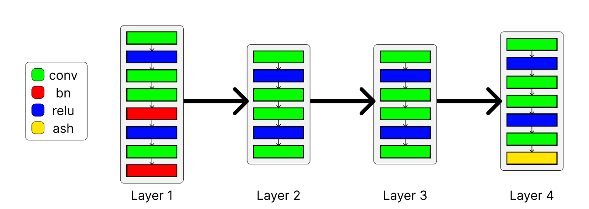
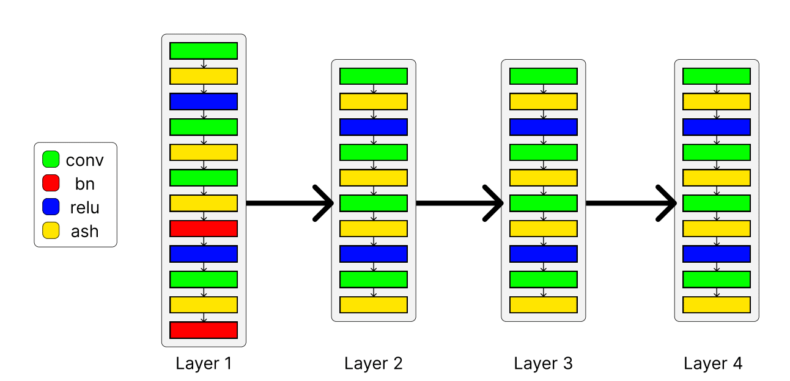
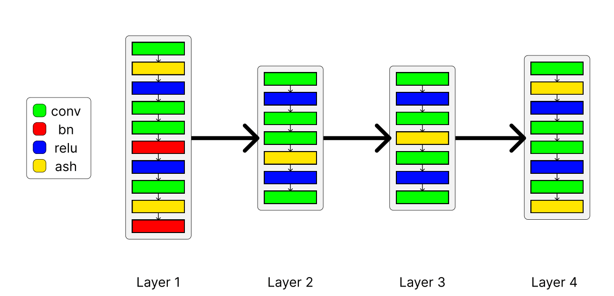
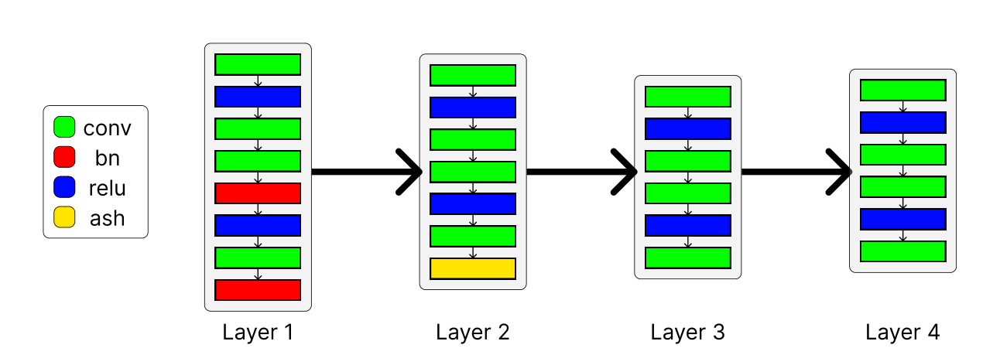

# Domain Adaptation Via Activation Shaping

## Baseline-->Point0

| Experiment | Source &rightarrow; Target | Accuracy | Loss |
| :---: | :---: | :---: | :---: |
| 0.1.1 | Art Painting &rightarrow; Cartoon | 54.61 | 0.01065 |
| 0.1.2 | Art Painting &rightarrow; Sketch | 40.42 | 0.01512 |
| 0.1.3 | Art Painting &rightarrow; Photo | 95.93 | 0.00107 |

## Random activation maps---->Point1 and Point2

### Activation Shaping module after last convolutional layer

| Experiment | Mask out ratio | Source &rightarrow; Target | Accuracy | Loss |
| :---: | :---: | :---: | :---: | :---: |
| 1.1.1 | 0.1 | Art Painting &rightarrow; Cartoon | 43.17 | 0.01155 |
| 1.1.2 | 0.1 | Art Painting &rightarrow; Sketch | 38.23 | 0.01416 |
| 1.1.3 | 0.1 | Art Painting &rightarrow; Photo | 91.50 | 0.00309 |
| 2.1.1 | 0.4 | Art Painting &rightarrow; Cartoon | 43.90 | 0.01151 |
| 2.1.2 | 0.4 | Art Painting &rightarrow; Sketch | 39.81 | 0.01391 |
| 2.1.3 | 0.4 | Art Painting &rightarrow; Photo | 91.02 | 0.00365 |
| 2.1.4 | 0.55 | Art Painting &rightarrow; Cartoon | 44.03 | 0.01152 |
| 2.1.5 | 0.55 | Art Painting &rightarrow; Sketch | 39.45 | 0.01382 |
| 2.1.6 | 0.55 | Art Painting &rightarrow; Photo | 89.94 | 0.00407 |
| 2.1.7 | 0.75 | Art Painting &rightarrow; Cartoon | 42.92 | 0.01206 |
| 2.1.8 | 0.75 | Art Painting &rightarrow; Sketch | 37.21 | 0.01415 |
| 2.1.9 | 0.75 | Art Painting &rightarrow; Photo | 88.02 | 0.00524 |

### Activation Shaping module after each convolutional layer

| Experiment | Mask out ratio | Source &rightarrow; Target | Accuracy | Loss |
| :---: | :---: | :---: | :---: | :---: |
| 1.2.1 | 0.1 | Art Painting &rightarrow; Cartoon | 21.80 | 0.01527 |
| 1.2.2 | 0.1 | Art Painting &rightarrow; Sketch | 16.98 | 0.01557 |
| 1.2.3 | 0.1 | Art Painting &rightarrow; Photo | 27.31 | 0.01549 |
| 2.2.1 | 0.4 | Art Painting &rightarrow; Cartoon | 18.09 | 0.01561 |
| 2.2.2 | 0.4 | Art Painting &rightarrow; Sketch | 8.88 | 0.01613 |
| 2.2.3 | 0.4 | Art Painting &rightarrow; Photo | 21.98 | 0.01596 |
| 2.2.4 | 0.55 | Art Painting &rightarrow; Cartoon | 16.68 | 0.01567 |
| 2.2.5 | 0.55 | Art Painting &rightarrow; Sketch | 7.51 | 0.01626 |
| 2.2.6 | 0.55 | Art Painting &rightarrow; Photo | 23.17 | 0.01600 |
| 2.2.7 | 0.75 | Art Painting &rightarrow; Cartoon | 17.62 | 0.01563 |
| 2.2.8 | 0.75 | Art Painting &rightarrow; Sketch | 7.61 | 0.01623 |
| 2.2.9 | 0.75 | Art Painting &rightarrow; Photo | 23.54 | 0.0165980 |

### Activation Shaping module after every three convolutional layers

| Experiment | Mask out ratio | Source &rightarrow; Target | Accuracy | Loss |
| :---: | :---: | :---: | :---: | :---: |
| 1.3.1 | 0.1 | Art Painting &rightarrow; Cartoon | 32.31 | 0.01509 |
| 1.3.2 | 0.1 | Art Painting &rightarrow; Sketch | 22.35 | 0.01471 |
| 1.3.3 | 0.1 | Art Painting &rightarrow; Photo | 67.19 | 0.00790 |
| 2.3.1 | 0.4 | Art Painting &rightarrow; Cartoon | 26.83 | 0.01531 |
| 2.3.2 | 0.4 | Art Painting &rightarrow; Sketch | 21.46 | 0.01537 |
| 2.3.3 | 0.4 | Art Painting &rightarrow; Photo | 53.47 | 0.01120 |
| 2.3.4 | 0.55 | Art Painting &rightarrow; Cartoon | 25.73 | 0.01530 |
| 2.3.5 | 0.55 | Art Painting &rightarrow; Sketch | 22.42 | 0.01530 |
| 2.3.6 | 0.55 | Art Painting &rightarrow; Photo | 43.17 | 0.01320 |
| 2.3.7 | 0.75 | Art Painting &rightarrow; Cartoon | 20.35 | 0.01555 |
| 2.3.8 | 0.75 | Art Painting &rightarrow; Sketch | 19.37 | 0.01547 |
| 2.3.9 | 0.75 | Art Painting &rightarrow; Photo | 37.15 | 0.01439 |

### Activation Shaping module after layer2.1.conv2

| Experiment | Mask out ratio | Source &rightarrow; Target | Accuracy | Loss |
| :---: | :---: | :---: | :---: | :---: |
| 2.4.1 | 0.4 | Art Painting &rightarrow; Cartoon | 53.03 | 0.0108566 |
| 2.4.2 | 0.4 | Art Painting &rightarrow; Sketch | 36.22 | 0.01763 |
| 2.4.3 | 0.4 | Art Painting &rightarrow; Photo | 93.41 | 0.001497 |
| 2.4.4 | 0.55 | Art Painting &rightarrow; Cartoon | 52.35 | 0.01095 |
| 2.4.5 | 0.55 | Art Painting &rightarrow; Sketch | 22.70 | 0.01534 |
| 2.4.6 | 0.55 | Art Painting &rightarrow; Photo | 92.75 | 0.001649 |
| 2.4.7 | 0.75 | Art Painting &rightarrow; Cartoon | 51.88 | 0.011069 |
| 2.4.8 | 0.75 | Art Painting &rightarrow; Sketch | 38.56 | 0.016040 |
| 2.4.9 | 0.75 | Art Painting &rightarrow; Photo | 92.04 | 0.0017556 |

### Activation Shaping module after layer3.1.conv2

| Experiment | Mask out ratio | Source &rightarrow; Target | Accuracy | Loss |
| :---: | :---: | :---: | :---: | :---: |
| 2.5.1 | 0.4 | Art Painting &rightarrow; Cartoon | 53.46 | 0.0107269 |
| 2.5.2 | 0.4 | Art Painting &rightarrow; Sketch | 31.92 | 0.0172201 |
| 2.5.3 | 0.4 | Art Painting &rightarrow; Photo | 94.31 | 0.00138117 |
| 2.5.4 | 0.55 | Art Painting &rightarrow; Cartoon | 52.82 | 0.011015 |
| 2.5.5 | 0.55 | Art Painting &rightarrow; Sketch | 33.01 | 0.01688 |
| 2.5.6 | 0.55 | Art Painting &rightarrow; Photo | 93.71 | 0.00155 |
| 2.5.7 | 0.75 | Art Painting &rightarrow; Cartoon | 50.17 | 0.01558 |
| 2.5.8 | 0.75 | Art Painting &rightarrow; Sketch | 32.63 | 0.01714 |
| 2.5.9 | 0.75 | Art Painting &rightarrow; Photo | 92.81 | 0.00173442 |

### Activation Shaping module after layer2.1.conv2 and layer3.1.conv2

| Experiment | Mask out ratio | Source &rightarrow; Target | Accuracy | Loss |
| :---: | :---: | :---: | :---: | :---: |
| 2.6.1 | 0.4 | Art Painting &rightarrow; Cartoon | 51.41 | 0.01129 |
| 2.6.2 | 0.4 | Art Painting &rightarrow; Sketch | 31.66 | 0.01641 |
| 2.6.3 | 0.4 | Art Painting &rightarrow; Photo | 90.96 | 0.002089 |
| 2.6.4 | 0.55 | Art Painting &rightarrow; Cartoon | 49.79 | 0.01146 |
| 2.6.5 | 0.55 | Art Painting &rightarrow; Sketch | 31.43 | 0.01595 |
| 2.6.6 | 0.55 | Art Painting &rightarrow; Photo | 89.58 | 0.002404 |
| 2.6.7 | 0.75 | Art Painting &rightarrow; Cartoon | 48.38 | 0.0119784 |
| 2.6.8 | 0.75 | Art Painting &rightarrow; Sketch | 29.88 | 0.0162943 |
| 2.6.9 | 0.75 | Art Painting &rightarrow; Photo | 87.60 | 0.00271583 |

## Random activation maps---->Point2 with mask of only 1

### Activation Shaping module after last convolutional layer
| Source &rightarrow; Target | Accuracy | Loss |
| :---: | :---: | :---: |
| Art Painting &rightarrow; Cartoon | 43.56 | 0.0115030 |
| Art Painting &rightarrow; Sketch | 38.99 | 0.01419 |
| Art Painting &rightarrow; Photo | 91.80 | 0.002949 |

### Activation Shaping module after layer3.1.conv2
| Source &rightarrow; Target | Accuracy | Loss |
| :---: | :---: | :---: |
| Art Painting &rightarrow; Cartoon | 54.52 | 0.0103305 |
| Art Painting &rightarrow; Sketch | 35.00 | 0.01620|
| Art Painting &rightarrow; Photo | 94.25 | 0.001289 |

### Activation Shaping module after layer2.1.conv2
| Source &rightarrow; Target | Accuracy | Loss |
| :---: | :---: | :---: |
| Art Painting &rightarrow; Cartoon | 53.75 | 0.01084 |
| Art Painting &rightarrow; Sketch | 35.38 | 0.01815 |
| Art Painting &rightarrow; Photo | 94.19 | 0.0012903 |

### Activation Shaping module after layer2.1.conv2 and layer3.1.conv2
| Source &rightarrow; Target | Accuracy | Loss |
| :---: | :---: | :---: |
| Art Painting &rightarrow; Cartoon | 52.77 | 0.01092 |
| Art Painting &rightarrow; Sketch | 33.06 | 0.01740 |
| Art Painting &rightarrow; Photo | 92.22 | 0.001668 |

### Activation Shaping module every 3 convolutional layers
| Source &rightarrow; Target | Accuracy | Loss |
| :---: | :---: | :---: |
| Art Painting &rightarrow; Cartoon | 29.39 | 0.01564 |
| Art Painting &rightarrow; Sketch | 22.14 | 0.01498 |
| Art Painting &rightarrow; Photo | 69.22 | 0.007309 |

### Activation Shaping module after each layer
| Source &rightarrow; Target | Accuracy | Loss |
| :---: | :---: | :---: |
| Art Painting &rightarrow; Cartoon | 22.44 | 0.01519 |
| Art Painting &rightarrow; Sketch | 13.41 | 0.01607 |
| Art Painting &rightarrow; Photo | 29.46 | 0.015113 |

## Adapting activation maps across domains---->Point3

### Activation maps across domains-->layer2.1.conv2
| Experiment | Source &rightarrow; Target | Accuracy | Loss |
| :---: | :---: | :---: | :---: |
| 3.1.1 | Art Painting &righarrow; Cartoon | 55.29 | 0.00962 |
| 3.1.2 | Art Painting &righarrow; Sketch | 39.42 | 0.01260 |
| 3.1.3 | Art Painting &righarrow; Photo | 89.52 | 0.00238 |

### Activation maps across domains-->layer2.0.conv2 and layer3.1.conv2

| Experiment | Source &rightarrow; Target | Accuracy | Loss |
| :---: | :---: | :---: | :---: |
| 3.2.1 | Art Painting &righarrow; Cartoon | 40.61 | 0.01672 |
| 3.2.2 | Art Painting &righarrow; Sketch | 19.27 | 0.022030 |
| 3.2.3 | Art Painting &righarrow; Photo | 55.75 | 0.010909 |

### Activation maps across domains-->layer2.1.conv2 and layer3.0.conv2

| Experiment | Source &rightarrow; Target | Accuracy | Loss |
| :---: | :---: | :---: | :---: |
| 3.3.1 | Art Painting &righarrow; Cartoon | 34.17 | 0.01334 |
| 3.3.2 | Art Painting &righarrow; Sketch | 5.78 | 0.02116 |
| 3.3.3 | Art Painting &righarrow; Photo | 47.49 | 0.01335 |

### Activation maps across domains-->layer1.1.conv2 and layer2.1.conv2

| Experiment | Source &rightarrow; Target | Accuracy | Loss |
| :---: | :---: | :---: | :---: |
| 3.4.1 | Art Painting &righarrow; Cartoon | 18.26 | 0.0295330 |
| 3.4.2 | Art Painting &righarrow; Sketch | 19.25 | 0.051066 |
| 3.4.3 | Art Painting &righarrow; Photo | 23.29 | 0.026932 |

# Extension 2- Binary Ablation

## Point1 reproducing point 2

### layer4.1.conv2
| Source &rightarrow; Target | Accuracy | Loss |
 | :---: | :---: | :---: |
 | Art Painting &righarrow; Cartoon | 45.65 | 0.0113826 |
 | Art Painting &righarrow; Sketch | 32.73| 0.0158096 |
 | Art Painting &righarrow; Photo | 92.63 | 0.00239498 |

 ### layer2.1.conv2
| Source &rightarrow; Target | Accuracy | Loss |
 | :---: | :---: | :---: |
 | Art Painting &righarrow; Cartoon | 54.65 | 0.01061 |
 | Art Painting &righarrow; Sketch | 40.67| 0.015035 |
 | Art Painting &righarrow; Photo | 95.39 | 0.0011936 |

  ### layer3.1.conv2
| Source &rightarrow; Target | Accuracy | Loss |
 | :---: | :---: | :---: |
 | Art Painting &righarrow; Cartoon | 53.54 | 0.0106167 |
 | Art Painting &righarrow; Sketch | 36.96| 0.0155487 |
 | Art Painting &righarrow; Photo | 95.33 | 0.001214 |

  ### layer2.1.conv2 and layer3.1.conv2
| Source &rightarrow; Target | Accuracy | Loss |
 | :---: | :---: | :---: |
 | Art Painting &righarrow; Cartoon | 54.27 | 0.0106167 |
 | Art Painting &righarrow; Sketch | 39.42| 0.0155487 |
 | Art Painting &righarrow; Photo | 94.67 | 0.0013158 |

  ### All layers
| Source &rightarrow; Target | Accuracy | Loss |
 | :---: | :---: | :---: |
 | Art Painting &righarrow; Cartoon | 20.35 | 0.0159648 |
 | Art Painting &righarrow; Sketch | 19.85| 0.01573 |
 | Art Painting &righarrow; Photo | 44.25 | 0.00131327 |

   ### Every 3 layers
| Source &rightarrow; Target | Accuracy | Loss |
 | :---: | :---: | :---: |
 | Art Painting &righarrow; Cartoon | 41.38 | 0.01238 |
 | Art Painting &righarrow; Sketch | 22.47| 0.016865 |
 | Art Painting &righarrow; Photo | 80.18 | 0.056895 |

## Point1 reproducing point 3

### layer2.0.conv2 and layer3.1.conv2
| Source &rightarrow; Target | Accuracy | Loss |
 | :---: | :---: | :---: |
 | Art Painting &righarrow; Cartoon | 10.71 | 0.0200 |
 | Art Painting &righarrow; Sketch | 21.35| 0.01780 |
 | Art Painting &righarrow; Photo | 12.75 | 0.02169 |

 ### layer2.1.conv2 and layer3.0.conv2
| Source &rightarrow; Target | Accuracy | Loss |
 | :---: | :---: | :---: |
 | Art Painting &righarrow; Cartoon | 16.55 | 0.0171679 |
 | Art Painting &righarrow; Sketch | 19.55| 0.0194581 |
 | Art Painting &righarrow; Photo | 28.98 | 0.016097 |

  ### layer1.1.conv2 and layer2.1.conv2
| Source &rightarrow; Target | Accuracy | Loss |
 | :---: | :---: | :---: |
 | Art Painting &righarrow; Cartoon | 18.64 | 0.030179 |
 | Art Painting &righarrow; Sketch | 19.65| 0.04557 |
 | Art Painting &righarrow; Photo | 23.71 | 0.020670 |

  ### layer2.1.conv2
| Source &rightarrow; Target | Accuracy | Loss |
 | :---: | :---: | :---: |
 | Art Painting &righarrow; Cartoon | 16.98 | 0.0231924 |
 | Art Painting &righarrow; Sketch | 22.60| 0.022627 |
 | Art Painting &righarrow; Photo | 36.77 | 0.002025 |

