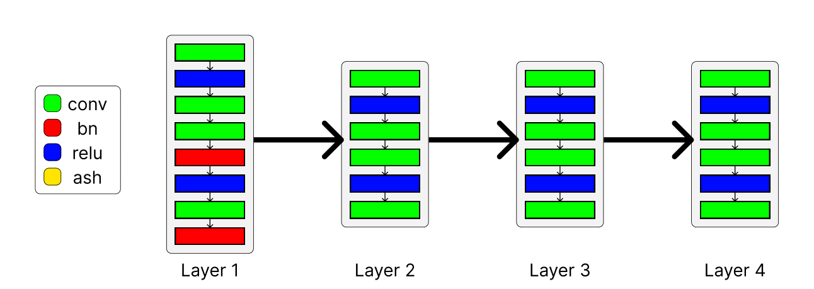

# Domain Adaptation Via Activation Shaping

## 0 - Baseline

| Experiment | Target | Accuracy | Loss |
| :---: | :---: | :---: | :---: |
| 0.1.1 | Cartoon | ___ | ___ |
| 0.1.2 | Sketch  | ___ | ___ |
| 0.1.3 | Photo   | ___ | ___ |

## 1 - Activation Shaping module

### 1.1 - ASH module after last convolutional layer

| Experiment | Mask out ratio | Target | Accuracy | Loss |
| :---: | :---: | :---: | :---: | :---: |
| 1.1.1 | 0.1 | Cartoon | ___ | ___ |
| 1.1.2 | 0.1 | Sketch  | ___ | ___ |
| 1.1.3 | 0.1 | Photo   | ___ | ___ |

### 1.2 - ASH module after all convolutional layers

| Experiment | Mask out ratio | Target | Accuracy | Loss |
| :---: | :---: | :---: | :---: | :---: |
| 1.2.1 | 0.1 | Cartoon | ___ | ___ |
| 1.2.2 | 0.1 | Sketch  | ___ | ___ |
| 1.2.3 | 0.1 | Photo   | ___ | ___ |

### 1.3 - ASH module after every three convolutional layers

| Experiment | Mask out ratio | Target | Accuracy | Loss |
| :---: | :---: | :---: | :---: | :---: |
| 1.3.1 | 0.1 | Cartoon | ___ | ___ |
| 1.3.2 | 0.1 | Sketch  | ___ | ___ |
| 1.3.3 | 0.1 | Photo   | ___ | ___ |

### 1.4 - ASH module after layer2.1.conv2

| Experiment | Mask out ratio | Target | Accuracy | Loss |
| :---: | :---: | :---: | :---: | :---: |
| 1.4.1 | 0.1 | Cartoon | ___ | ___ |
| 1.4.2 | 0.1 | Sketch  | ___ | ___ |
| 1.4.3 | 0.1 | Photo   | ___ | ___ |

### 1.5 - ASH module after layer3.1.conv2

| Experiment | Mask out ratio | Target | Accuracy | Loss |
| :---: | :---: | :---: | :---: | :---: |
| 1.5.1 | 0.1 | Cartoon | ___ | ___ |
| 1.5.2 | 0.1 | Sketch  | ___ | ___ |
| 1.5.3 | 0.1 | Photo   | ___ | ___ |

### 1.6 - ASH module after layer2.1.conv2 and layer3.1.conv2

| Experiment | Mask out ratio | Target | Accuracy | Loss |
| :---: | :---: | :---: | :---: | :---: |
| 1.6.1 | 0.1 | Cartoon | ___ | ___ |
| 1.6.2 | 0.1 | Sketch  | ___ | ___ |
| 1.6.3 | 0.1 | Photo   | ___ | ___ |

## 2 - Random Activation Maps

### 2.1 - ASH module after last convolutional layer

| Experiment | Mask out ratio | Target | Accuracy | Loss |
| :---: | :---: | :---: | :---: | :---: |
| 2.1.1 | 0.4 | Cartoon | ___ | ___ |
| 2.1.2 | 0.4 | Sketch  | ___ | ___ |
| 2.1.3 | 0.4 | Photo   | ___ | ___ |
| 2.1.4 | 0.55 | Cartoon | ___ | ___ |
| 2.1.5 | 0.55 | Sketch  | ___ | ___ |
| 2.1.6 | 0.55 | Photo   | ___ | ___ |
| 2.1.7 | 0.75 | Cartoon | ___ | ___ |
| 2.1.8 | 0.75 | Sketch  | ___ | ___ |
| 2.1.9 | 0.75 | Photo   | ___ | ___ |
| 2.1.10 | 0 | Cartoon | ___ | ___ |
| 2.1.11 | 0 | Sketch  | ___ | ___ |
| 2.1.12 | 0 | Photo   | ___ | ___ |

### 2.2 - ASH module after all convolutional layers

| Experiment | Mask out ratio | Target | Accuracy | Loss |
| :---: | :---: | :---: | :---: | :---: |
| 2.2.1 | 0.4 | Cartoon | ___ | ___ |
| 2.2.2 | 0.4 | Sketch  | ___ | ___ |
| 2.2.3 | 0.4 | Photo   | ___ | ___ |
| 2.2.4 | 0.55 | Cartoon | ___ | ___ |
| 2.2.5 | 0.55 | Sketch  | ___ | ___ |
| 2.2.6 | 0.55 | Photo   | ___ | ___ |
| 2.2.7 | 0.75 | Cartoon | ___ | ___ |
| 2.2.8 | 0.75 | Sketch  | ___ | ___ |
| 2.2.9 | 0.75 | Photo   | ___ | ___ |
| 2.2.10 | 0 | Cartoon | ___ | ___ |
| 2.2.11 | 0 | Sketch  | ___ | ___ |
| 2.2.12 | 0 | Photo   | ___ | ___ |

### 2.3 - ASH module after every three convolutional layers

| Experiment | Mask out ratio | Target | Accuracy | Loss |
| :---: | :---: | :---: | :---: | :---: |
| 2.3.1 | 0.4 | Cartoon | ___ | ___ |
| 2.3.2 | 0.4 | Sketch  | ___ | ___ |
| 2.3.3 | 0.4 | Photo   | ___ | ___ |
| 2.3.4 | 0.55 | Cartoon | ___ | ___ |
| 2.3.5 | 0.55 | Sketch  | ___ | ___ |
| 2.3.6 | 0.55 | Photo   | ___ | ___ |
| 2.3.7 | 0.75 | Cartoon | ___ | ___ |
| 2.3.8 | 0.75 | Sketch  | ___ | ___ |
| 2.3.9 | 0.75 | Photo   | ___ | ___ |
| 2.3.10 | 0 | Cartoon | ___ | ___ |
| 2.3.11 | 0 | Sketch  | ___ | ___ |
| 2.3.12 | 0 | Photo   | ___ | ___ |

### 2.4 - ASH module after layer2.1.conv2

| Experiment | Mask out ratio | Target | Accuracy | Loss |
| :---: | :---: | :---: | :---: | :---: |
| 2.4.1 | 0.4 | Cartoon | ___ | ___ |
| 2.4.2 | 0.4 | Sketch  | ___ | ___ |
| 2.4.3 | 0.4 | Photo   | ___ | ___ |
| 2.4.4 | 0.55 | Cartoon | ___ | ___ |
| 2.4.5 | 0.55 | Sketch  | ___ | ___ |
| 2.4.6 | 0.55 | Photo   | ___ | ___ |
| 2.4.7 | 0.75 | Cartoon | ___ | ___ |
| 2.4.8 | 0.75 | Sketch  | ___ | ___ |
| 2.4.9 | 0.75 | Photo   | ___ | ___ |
| 2.4.10 | 0 | Cartoon | ___ | ___ |
| 2.4.11 | 0 | Sketch  | ___ | ___ |
| 2.4.12 | 0 | Photo   | ___ | ___ |

### 2.5 - ASH module after layer3.1.conv2

| Experiment | Mask out ratio | Target | Accuracy | Loss |
| :---: | :---: | :---: | :---: | :---: |
| 2.5.1 | 0.4 | Cartoon | ___ | ___ |
| 2.5.2 | 0.4 | Sketch  | ___ | ___ |
| 2.5.3 | 0.4 | Photo   | ___ | ___ |
| 2.5.4 | 0.55 | Cartoon | ___ | ___ |
| 2.5.5 | 0.55 | Sketch  | ___ | ___ |
| 2.5.6 | 0.55 | Photo   | ___ | ___ |
| 2.5.7 | 0.75 | Cartoon | ___ | ___ |
| 2.5.8 | 0.75 | Sketch  | ___ | ___ |
| 2.5.9 | 0.75 | Photo   | ___ | ___ |
| 2.5.10 | 0 | Cartoon | ___ | ___ |
| 2.5.11 | 0 | Sketch  | ___ | ___ |
| 2.5.12 | 0 | Photo   | ___ | ___ |

### 2.6 - ASH module after layer2.1.conv2 and layer3.1.conv2

| Experiment | Mask out ratio | Target | Accuracy | Loss |
| :---: | :---: | :---: | :---: | :---: |
| 2.6.1 | 0.4 | Cartoon | ___ | ___ |
| 2.6.2 | 0.4 | Sketch  | ___ | ___ |
| 2.6.3 | 0.4 | Photo   | ___ | ___ |
| 2.6.4 | 0.55 | Cartoon | ___ | ___ |
| 2.6.5 | 0.55 | Sketch  | ___ | ___ |
| 2.6.6 | 0.55 | Photo   | ___ | ___ |
| 2.6.7 | 0.75 | Cartoon | ___ | ___ |
| 2.6.8 | 0.75 | Sketch  | ___ | ___ |
| 2.6.9 | 0.75 | Photo   | ___ | ___ |
| 2.6.10 | 0 | Cartoon | ___ | ___ |
| 2.6.11 | 0 | Sketch  | ___ | ___ |
| 2.6.12 | 0 | Photo   | ___ | ___ |

## 3 - Adapting Activation Maps across Domains

### 3.1 - ASH module after layer2.0.conv2 and layer3.1.conv2

| Experiment | Target | Accuracy | Loss |
| :---: | :---: | :---: | :---: |
| 3.1.1 | Cartoon | ___ | ___ |
| 3.1.2 | Sketch  | ___ | ___ |
| 3.1.3 | Photo   | ___ | ___ |

### 3.2 - ASH module after layer2.1.conv2 and layer3.0.conv2

| Experiment | Target | Accuracy | Loss |
| :---: | :---: | :---: | :---: |
| 3.2.1 | Cartoon | ___ | ___ |
| 3.2.2 | Sketch  | ___ | ___ |
| 3.2.3 | Photo   | ___ | ___ |

### 3.3 - ASH module after layer1.1.conv2 and layer2.1.conv2

| Experiment | Target | Accuracy | Loss |
| :---: | :---: | :---: | :---: |
| 3.3.1 | Cartoon | ___ | ___ |
| 3.3.2 | Sketch  | ___ | ___ |
| 3.3.3 | Photo   | ___ | ___ |

### 3.4 - ASH module after layer2.1.conv2

| Experiment | Target | Accuracy | Loss |
| :---: | :---: | :---: | :---: |
| 3.4.1 | Cartoon | ___ | ___ |
| 3.4.2 | Sketch  | ___ | ___ |
| 3.4.3 | Photo   | ___ | ___ |

## Extension 2 - Binarization Ablation

### 4.1 - Reproduction of Point 2

#### 4.1.1 - ASH module after last convolutional layer

| Experiment | Mask out ratio | Target | Accuracy | Loss |
| :---: | :---: | :---: | :---: | :---: |
| 4.1.1.1 | 0.4 | Cartoon | ___ | ___ |
| 4.1.1.2 | 0.4 | Sketch  | ___ | ___ |
| 4.1.1.3 | 0.4 | Photo   | ___ | ___ |
| 4.1.1.4 | 0.55 | Cartoon | ___ | ___ |
| 4.1.1.5 | 0.55 | Sketch  | ___ | ___ |
| 4.1.1.6 | 0.55 | Photo   | ___ | ___ |
| 4.1.1.7 | 0.75 | Cartoon | ___ | ___ |
| 4.1.1.8 | 0.75 | Sketch  | ___ | ___ |
| 4.1.1.9 | 0.75 | Photo   | ___ | ___ |
| 4.1.1.10 | 0 | Cartoon | ___ | ___ |
| 4.1.1.11 | 0 | Sketch  | ___ | ___ |
| 4.1.1.12 | 0 | Photo   | ___ | ___ |

#### 4.1.2 - ASH module after all convolutional layers

| Experiment | Mask out ratio | Target | Accuracy | Loss |
| :---: | :---: | :---: | :---: | :---: |
| 4.1.2.1 | 0.4 | Cartoon | ___ | ___ |
| 4.1.2.2 | 0.4 | Sketch  | ___ | ___ |
| 4.1.2.3 | 0.4 | Photo   | ___ | ___ |
| 4.1.2.4 | 0.55 | Cartoon | ___ | ___ |
| 4.1.2.5 | 0.55 | Sketch  | ___ | ___ |
| 4.1.2.6 | 0.55 | Photo   | ___ | ___ |
| 4.1.2.7 | 0.75 | Cartoon | ___ | ___ |
| 4.1.2.8 | 0.75 | Sketch  | ___ | ___ |
| 4.1.2.9 | 0.75 | Photo   | ___ | ___ |
| 4.1.2.10 | 0 | Cartoon | ___ | ___ |
| 4.1.2.11 | 0 | Sketch  | ___ | ___ |
| 4.1.2.12 | 0 | Photo   | ___ | ___ |

#### 4.1.3 - ASH module after every three convolutional layers

| Experiment | Mask out ratio | Target | Accuracy | Loss |
| :---: | :---: | :---: | :---: | :---: |
| 4.1.3.1 | 0.4 | Cartoon | ___ | ___ |
| 4.1.3.2 | 0.4 | Sketch  | ___ | ___ |
| 4.1.3.3 | 0.4 | Photo   | ___ | ___ |
| 4.1.3.4 | 0.55 | Cartoon | ___ | ___ |
| 4.1.3.5 | 0.55 | Sketch  | ___ | ___ |
| 4.1.3.6 | 0.55 | Photo   | ___ | ___ |
| 4.1.3.7 | 0.75 | Cartoon | ___ | ___ |
| 4.1.3.8 | 0.75 | Sketch  | ___ | ___ |
| 4.1.3.9 | 0.75 | Photo   | ___ | ___ |
| 4.1.3.10 | 0 | Cartoon | ___ | ___ |
| 4.1.3.11 | 0 | Sketch  | ___ | ___ |
| 4.1.3.12 | 0 | Photo   | ___ | ___ |

#### 4.1.4 - ASH module after layer2.1.conv2

| Experiment | Mask out ratio | Target | Accuracy | Loss |
| :---: | :---: | :---: | :---: | :---: |
| 4.1.4.1 | 0.4 | Cartoon | ___ | ___ |
| 4.1.4.2 | 0.4 | Sketch  | ___ | ___ |
| 4.1.4.3 | 0.4 | Photo   | ___ | ___ |
| 4.1.4.4 | 0.55 | Cartoon | ___ | ___ |
| 4.1.4.5 | 0.55 | Sketch  | ___ | ___ |
| 4.1.4.6 | 0.55 | Photo   | ___ | ___ |
| 4.1.4.7 | 0.75 | Cartoon | ___ | ___ |
| 4.1.4.8 | 0.75 | Sketch  | ___ | ___ |
| 4.1.4.9 | 0.75 | Photo   | ___ | ___ |
| 4.1.4.10 | 0 | Cartoon | ___ | ___ |
| 4.1.4.11 | 0 | Sketch  | ___ | ___ |
| 4.1.4.12 | 0 | Photo   | ___ | ___ |

#### 4.1.5 - ASH module after layer3.1.conv2

| Experiment | Mask out ratio | Target | Accuracy | Loss |
| :---: | :---: | :---: | :---: | :---: |
| 4.1.5.1 | 0.4 | Cartoon | ___ | ___ |
| 4.1.5.2 | 0.4 | Sketch  | ___ | ___ |
| 4.1.5.3 | 0.4 | Photo   | ___ | ___ |
| 4.1.5.4 | 0.55 | Cartoon | ___ | ___ |
| 4.1.5.5 | 0.55 | Sketch  | ___ | ___ |
| 4.1.5.6 | 0.55 | Photo   | ___ | ___ |
| 4.1.5.7 | 0.75 | Cartoon | ___ | ___ |
| 4.1.5.8 | 0.75 | Sketch  | ___ | ___ |
| 4.1.5.9 | 0.75 | Photo   | ___ | ___ |
| 4.1.5.10 | 0 | Cartoon | ___ | ___ |
| 4.1.5.11 | 0 | Sketch  | ___ | ___ |
| 4.1.5.12 | 0 | Photo   | ___ | ___ |

#### 4.1.6 - ASH module after layer2.1.conv2 and layer3.1.conv2

| Experiment | Mask out ratio | Target | Accuracy | Loss |
| :---: | :---: | :---: | :---: | :---: |
| 4.1.6.1 | 0.4 | Cartoon | ___ | ___ |
| 4.1.6.2 | 0.4 | Sketch  | ___ | ___ |
| 4.1.6.3 | 0.4 | Photo   | ___ | ___ |
| 4.1.6.4 | 0.55 | Cartoon | ___ | ___ |
| 4.1.6.5 | 0.55 | Sketch  | ___ | ___ |
| 4.1.6.6 | 0.55 | Photo   | ___ | ___ |
| 4.1.6.7 | 0.75 | Cartoon | ___ | ___ |
| 4.1.6.8 | 0.75 | Sketch  | ___ | ___ |
| 4.1.6.9 | 0.75 | Photo   | ___ | ___ |
| 4.1.6.10 | 0 | Cartoon | ___ | ___ |
| 4.1.6.11 | 0 | Sketch  | ___ | ___ |
| 4.1.6.12 | 0 | Photo   | ___ | ___ |

### 4.2 - Reproduction of Point 3

#### 4.2.1 - ASH module after layer2.0.conv2 and layer3.1.conv2

| Experiment | Target | Accuracy | Loss |
| :---: | :---: | :---: | :---: |
| 4.2.1.1 | Cartoon | ___ | ___ |
| 4.2.1.2 | Sketch  | ___ | ___ |
| 4.2.1.3 | Photo   | ___ | ___ |

#### 4.2.2 - ASH module after layer2.1.conv2 and layer3.0.conv2

| Experiment | Target | Accuracy | Loss |
| :---: | :---: | :---: | :---: |
| 4.2.2.1 | Cartoon | ___ | ___ |
| 4.2.2.2 | Sketch  | ___ | ___ |
| 4.2.2.3 | Photo   | ___ | ___ |

#### 4.2.3 - ASH module after layer1.1.conv2 and layer2.1.conv2

| Experiment | Target | Accuracy | Loss |
| :---: | :---: | :---: | :---: |
| 4.2.3.1 | Cartoon | ___ | ___ |
| 4.2.3.2 | Sketch  | ___ | ___ |
| 4.2.3.3 | Photo   | ___ | ___ |

#### 4.2.4 - ASH module after layer2.1.conv2

| Experiment | Target | Accuracy | Loss |
| :---: | :---: | :---: | :---: |
| 4.2.4.1 | Cartoon | ___ | ___ |
| 4.2.4.2 | Sketch  | ___ | ___ |
| 4.2.4.3 | Photo   | ___ | ___ |

### 4.3 - Reproduction of Point 2

#### 4.3.1 - ASH module after last convolutional layer

| Experiment | Mask out ratio | Target | Accuracy | Loss |
| :---: | :---: | :---: | :---: | :---: |
| 4.3.1.1 | 0.4 | Cartoon | ___ | ___ |
| 4.3.1.2 | 0.4 | Sketch  | ___ | ___ |
| 4.3.1.3 | 0.4 | Photo   | ___ | ___ |
| 4.3.1.4 | 0.55 | Cartoon | ___ | ___ |
| 4.3.1.5 | 0.55 | Sketch  | ___ | ___ |
| 4.3.1.6 | 0.55 | Photo   | ___ | ___ |
| 4.3.1.7 | 0.75 | Cartoon | ___ | ___ |
| 4.3.1.8 | 0.75 | Sketch  | ___ | ___ |
| 4.3.1.9 | 0.75 | Photo   | ___ | ___ |
| 4.3.1.10 | 0 | Cartoon | ___ | ___ |
| 4.3.1.11 | 0 | Sketch  | ___ | ___ |
| 4.3.1.12 | 0 | Photo   | ___ | ___ |

#### 4.3.2 - ASH module after all convolutional layers

| Experiment | Mask out ratio | Target | Accuracy | Loss |
| :---: | :---: | :---: | :---: | :---: |
| 4.3.2.1 | 0.4 | Cartoon | ___ | ___ |
| 4.3.2.2 | 0.4 | Sketch  | ___ | ___ |
| 4.3.2.3 | 0.4 | Photo   | ___ | ___ |
| 4.3.2.4 | 0.55 | Cartoon | ___ | ___ |
| 4.3.2.5 | 0.55 | Sketch  | ___ | ___ |
| 4.3.2.6 | 0.55 | Photo   | ___ | ___ |
| 4.3.2.7 | 0.75 | Cartoon | ___ | ___ |
| 4.3.2.8 | 0.75 | Sketch  | ___ | ___ |
| 4.3.2.9 | 0.75 | Photo   | ___ | ___ |
| 4.3.2.10 | 0 | Cartoon | ___ | ___ |
| 4.3.2.11 | 0 | Sketch  | ___ | ___ |
| 4.3.2.12 | 0 | Photo   | ___ | ___ |

#### 4.3.3 - ASH module after every three convolutional layers

| Experiment | Mask out ratio | Target | Accuracy | Loss |
| :---: | :---: | :---: | :---: | :---: |
| 4.3.3.1 | 0.4 | Cartoon | ___ | ___ |
| 4.3.3.2 | 0.4 | Sketch  | ___ | ___ |
| 4.3.3.3 | 0.4 | Photo   | ___ | ___ |
| 4.3.3.4 | 0.55 | Cartoon | ___ | ___ |
| 4.3.3.5 | 0.55 | Sketch  | ___ | ___ |
| 4.3.3.6 | 0.55 | Photo   | ___ | ___ |
| 4.3.3.7 | 0.75 | Cartoon | ___ | ___ |
| 4.3.3.8 | 0.75 | Sketch  | ___ | ___ |
| 4.3.3.9 | 0.75 | Photo   | ___ | ___ |
| 4.3.3.10 | 0 | Cartoon | ___ | ___ |
| 4.3.3.11 | 0 | Sketch  | ___ | ___ |
| 4.3.3.12 | 0 | Photo   | ___ | ___ |

#### 4.3.4 - ASH module after layer2.1.conv2

| Experiment | Mask out ratio | Target | Accuracy | Loss |
| :---: | :---: | :---: | :---: | :---: |
| 4.3.4.3 | 0.4 | Cartoon | ___ | ___ |
| 4.3.4.2 | 0.4 | Sketch  | ___ | ___ |
| 4.3.4.3 | 0.4 | Photo   | ___ | ___ |
| 4.3.4.4 | 0.55 | Cartoon | ___ | ___ |
| 4.3.4.5 | 0.55 | Sketch  | ___ | ___ |
| 4.3.4.6 | 0.55 | Photo   | ___ | ___ |
| 4.3.4.7 | 0.75 | Cartoon | ___ | ___ |
| 4.3.4.8 | 0.75 | Sketch  | ___ | ___ |
| 4.3.4.9 | 0.75 | Photo   | ___ | ___ |
| 4.3.4.10 | 0 | Cartoon | ___ | ___ |
| 4.3.4.11 | 0 | Sketch  | ___ | ___ |
| 4.3.4.12 | 0 | Photo   | ___ | ___ |

#### 4.3.5 - ASH module after layer3.1.conv2

| Experiment | Mask out ratio | Target | Accuracy | Loss |
| :---: | :---: | :---: | :---: | :---: |
| 4.3.5.1 | 0.4 | Cartoon | ___ | ___ |
| 4.3.5.2 | 0.4 | Sketch  | ___ | ___ |
| 4.3.5.3 | 0.4 | Photo   | ___ | ___ |
| 4.3.5.4 | 0.55 | Cartoon | ___ | ___ |
| 4.3.5.5 | 0.55 | Sketch  | ___ | ___ |
| 4.3.5.6 | 0.55 | Photo   | ___ | ___ |
| 4.3.5.7 | 0.75 | Cartoon | ___ | ___ |
| 4.3.5.8 | 0.75 | Sketch  | ___ | ___ |
| 4.3.5.9 | 0.75 | Photo   | ___ | ___ |
| 4.3.5.10 | 0 | Cartoon | ___ | ___ |
| 4.3.5.11 | 0 | Sketch  | ___ | ___ |
| 4.3.5.12 | 0 | Photo   | ___ | ___ |

#### 4.3.6 - ASH module after layer2.1.conv2 and layer3.1.conv2

| Experiment | Mask out ratio | Target | Accuracy | Loss |
| :---: | :---: | :---: | :---: | :---: |
| 4.3.6.1 | 0.4 | Cartoon | ___ | ___ |
| 4.3.6.2 | 0.4 | Sketch  | ___ | ___ |
| 4.3.6.3 | 0.4 | Photo   | ___ | ___ |
| 4.3.6.4 | 0.55 | Cartoon | ___ | ___ |
| 4.3.6.5 | 0.55 | Sketch  | ___ | ___ |
| 4.3.6.6 | 0.55 | Photo   | ___ | ___ |
| 4.3.6.7 | 0.75 | Cartoon | ___ | ___ |
| 4.3.6.8 | 0.75 | Sketch  | ___ | ___ |
| 4.3.6.9 | 0.75 | Photo   | ___ | ___ |
| 4.3.6.10 | 0 | Cartoon | ___ | ___ |
| 4.3.6.11 | 0 | Sketch  | ___ | ___ |
| 4.3.6.12 | 0 | Photo   | ___ | ___ |

### 4.4 - Reproduction of Point 3

#### 4.4.1 - ASH module after layer2.0.conv2 and layer3.1.conv2

| Experiment | Target | Accuracy | Loss |
| :---: | :---: | :---: | :---: |
| 4.4.1.1 | Cartoon | ___ | ___ |
| 4.4.1.2 | Sketch  | ___ | ___ |
| 4.4.1.3 | Photo   | ___ | ___ |

#### 4.4.2 - ASH module after layer2.1.conv2 and layer3.0.conv2

| Experiment | Target | Accuracy | Loss |
| :---: | :---: | :---: | :---: |
| 4.4.2.1 | Cartoon | ___ | ___ |
| 4.4.2.2 | Sketch  | ___ | ___ |
| 4.4.2.3 | Photo   | ___ | ___ |

#### 4.4.3 - ASH module after layer1.1.conv2 and layer2.1.conv2

| Experiment | Target | Accuracy | Loss |
| :---: | :---: | :---: | :---: |
| 4.4.3.1 | Cartoon | ___ | ___ |
| 4.4.3.2 | Sketch  | ___ | ___ |
| 4.4.3.3 | Photo   | ___ | ___ |

#### 4.4.4 - ASH module after layer2.1.conv2

| Experiment | Target | Accuracy | Loss |
| :---: | :---: | :---: | :---: |
| 4.4.4.1 | Cartoon | ___ | ___ |
| 4.4.4.2 | Sketch  | ___ | ___ |
| 4.4.4.3 | Photo   | ___ | ___ |
